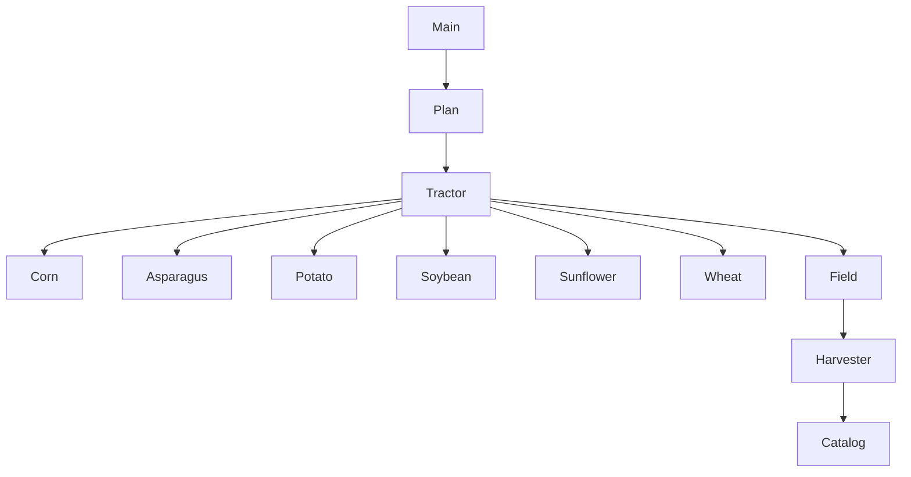

```mermaid
graph TD;
  A[Main] --> B[Plan];
  B --> C[Tractor];
  C --> D[Corn];
  C --> E[Asparagus];
  C --> F[Potato];
  C --> G[Soybean];
  C --> H[Sunflower];
  C --> I[Wheat];
  C --> J[Field];
  J --> K[Harvester];
  K --> L[Catalog];

```