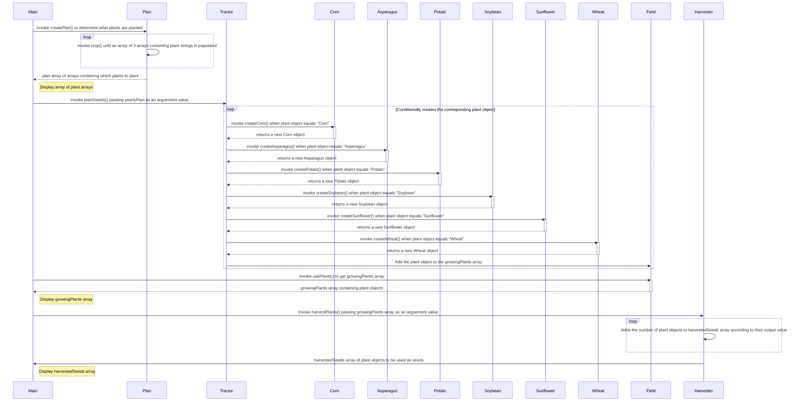

## Modern Farm Sequence Diagram

```mermaid
sequenceDiagram
    participant Main
    participant Plan
    Main->>Plan: Invoke createPlan() to determine what plants are planted

    loop 
        Plan->>Plan: invoke crop() until an array of 3 arrays containing plant strings is populated
    end

    Plan-->>Main: plan array of arrays containing which plants to plant
    note right of Main: Display array of plant arrays

    participant Tractor
    participant Corn
    participant Asparagus
    participant Potato
    participant Soybean
    participant Sunflower
    participant Wheat
    participant Field
    Main->>Tractor: Invoke plantSeeds() passing yearlyPlan as an arguement value

    loop Conditionally creates the corresponding plant object
    
        
        Tractor->>Corn: invoke createCorn() when plant object equals "Corn"
        activate Corn
        Corn-->>Tractor: returns a new Corn object
        deactivate Corn

        Tractor->>Asparagus: invoke createAsparagus() when plant object equals "Asparagus"
        activate Asparagus
        Asparagus-->>Tractor: returns a new Asparagus object
        deactivate Asparagus

        Tractor->>Potato: invoke createPotato() when plant object equals "Potato"
        activate Potato
        Potato-->>Tractor: returns a new Potato object
        deactivate Potato

        Tractor->>Soybean: invoke createSoybean() when plant object equals "Soybean"
        activate Soybean
        Soybean-->>Tractor: returns a new Soybean object
        deactivate Soybean

        Tractor->>Sunflower: invoke createSunflower() when plant object equals "Sunflower"
        activate Sunflower
        Sunflower-->>Tractor: returns a new Sunflower object
        deactivate Sunflower

        Tractor->>Wheat: invoke createWheat() when plant object equals "Wheat"
        activate Wheat
        Wheat-->>Tractor: returns a new Wheat object
        deactivate Wheat

        Tractor->>Field: Add the plant object to the growingPlants array

    end

    Main->>Field: Invoke usePlants() to get growingPlants array
    activate Field
    Field-->>Main: growingPlants array containing plant objects
    deactivate Field

    note right of Main: Display growingPlants array

    Main->>Harvester: Invoke harvestPlants() passing growingPlants array as an arguement value

    loop 

        Harvester->>Harvester: Adds the number of plant objects to harvestedSeeds array according to their output value
    end

    Harvester->>Main: harvestedSeeds array of plant objects to be used as seeds
    note right of Main: Display harvestedSeeds array

   

    
```