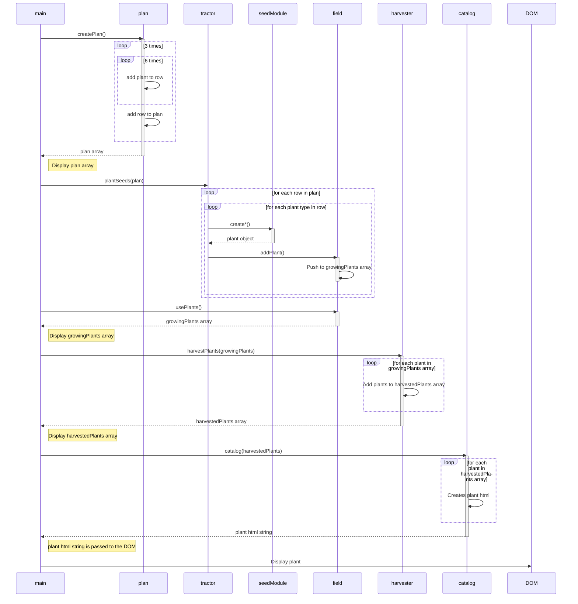

## Modern Farm Sequence Diagram

```mermaid
sequenceDiagram
    participant main
    participant plan
        main->>plan: createPlan()
            activate plan

            loop 3 times 
                loop 6 times
                    plan->>plan: add plant to row
                end 
                plan->>plan: add row to plan
            end

        plan-->>main: plan array
            deactivate plan

            note right of main: Display plan array


    participant tractor
    participant seedModule
    participant field
        main->>tractor: plantSeeds(plan);

            loop for each row in plan      
                loop for each plant type in row 
                    tractor->>seedModule: create*()
                    activate seedModule
                    seedModule-->>tractor: plant object
                    deactivate seedModule

                    tractor->>field: addPlant()
                    activate field
                    field->>field: Push to growingPlants array
                    deactivate field
                end
                
            end

        main->>field: usePlants()
            activate field
        field-->>main: growingPlants array
            deactivate field

            note right of main: Display growingPlants array


    participant harvester
        main->>harvester: harvestPlants(growingPlants)
            activate harvester

            loop for each plant in growingPlants array
                harvester->>harvester: Add plants to harvestedPlants array
            end

        harvester-->>main: harvestedPlants array
            deactivate harvester
            
            note right of main: Display harvestedPlants array


    participant catalog
        main->>catalog: catalog(harvestedPlants)
            activate catalog

            loop for each plant in harvestedPlants array
                catalog->>catalog: Creates plant html
            end 

        catalog-->>main: plant html string
            deactivate catalog
            
            note right of main: plant html string is passed to the DOM


    participant DOM
        main->>DOM: Display plant

   

    
```